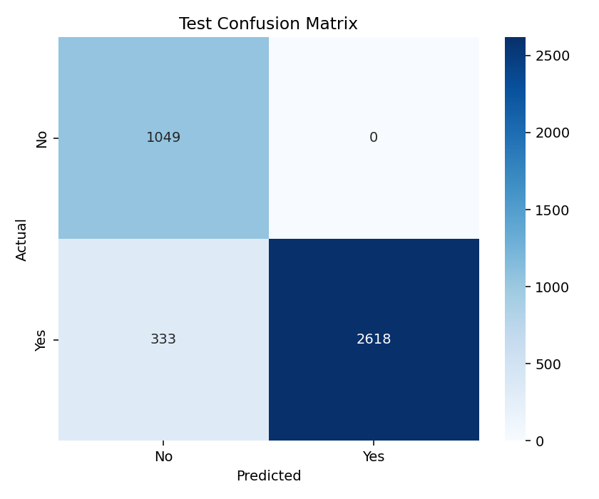

# Shipment Delay Prediction

This project predicts whether a shipment will be delayed (`Yes`) or on time (`No`) using historical logistics data.  
It is built as an end-to-end machine learning workflow, starting from preprocessing and model training, and finishing with a Streamlit web app for single-shipment prediction.

The goal is simple: a user enters shipment details such as route, vehicle type, distance, weather, and traffic, and the system returns:
- predicted delay label (`Yes` or `No`)
- delay probability
- risk band (`Low`, `Medium`, `High`)

---

## What this project includes

- `playground.ipynb` for experimentation and model comparison
- `data_preprocessing.py` for clean, reusable preprocessing and feature engineering
- `train.py` to train the finalized model and save artifacts
- `evaluate.py` to evaluate model performance and save analysis files
- `predict.py` for batch prediction from CSV input
- `app.py` for a web UI using Streamlit


## Model used

During notebook experimentation, we trained and compared three classifiers:
- Logistic Regression
- Decision Tree
- Random Forest

Each model was evaluated on a stratified train/test split using class-aware metrics (especially Recall and F1 for delayed shipments), along with overall Accuracy and ROC-AUC. We also checked train-vs-test gap to identify overfitting or unstable behavior.

After comparison, the finalized model is:
- **Logistic Regression (Baseline)**

---

## Performance (test set)

From `eval_results/evaluation_summary.json`:
- **Accuracy:** 91.68%
- **Precision (Yes):** 100.00%
- **Recall (Yes):** 88.72%
- **F1-score (Yes):** 94.02%
- **ROC-AUC:** 94.45%

Class-wise correctness from `eval_results/class_wise_summary.csv`:
- `No`: 1049/1049 correct (100.00%)
- `Yes`: 2618/2951 correct (88.72%)

---

In this project, `Yes` means delayed, and `Yes` is treated as the positive class.

- **Precision (Yes):** Out of all shipments predicted as delayed, how many were actually delayed.
- **Recall (Yes):** Out of all actually delayed shipments, how many the model correctly found.
- **F1-score (Yes):** A single score that balances precision and recall.
- **ROC-AUC:** How well the model separates delayed vs on-time shipments using probability scores.
- **Accuracy:** Overall correct predictions across both delayed and on-time shipments.

---

## Visual results

### 1) Streamlit app interface


### 2) Confusion matrix

---

## How to run this project

### 1) Create virtual environment (`myenv`)

```bash
python -m venv myenv
```

Activate it:
```bash
# Windows (Git Bash)
source myenv/Scripts/activate
```

### 2) Install dependencies

```bash
pip install -r requirements.txt
```

### 3) Run preprocessing sanity check

```bash
python data_preprocessing.py
```

### 4) Train model

```bash
python train.py
```

This saves:
- `models/model_pipeline.joblib`
- `models/training_summary.json`

### 5) Evaluate model

```bash
python evaluate.py
```

### 6) Run batch prediction

```bash
python predict.py
```

### 7) Run web app

```bash
streamlit run app.py
```

Open the local URL shown in terminal (usually `http://localhost:8501`).

---

## How anyone can use it

1. Open the Streamlit app.
2. Select shipment inputs from dropdowns and fill distance/date fields.
3. Click **Predict Delay Risk**.
4. Read the prediction card:
   - Delay label (`Yes`/`No`)
   - Probability value
   - Risk band and recommendation message
---

## Project outputs

## Project outputs

- Predicts whether a shipment will be Delayed (`Yes`) or On-time (`No`).
- Shows a delay probability score for each shipment.
- Groups risk into `Low` / `Medium` / `High` bands for quick decisions.
- Helps teams identify high-risk shipments early and take action.
- Generates evaluation reports like confusion matrix, class-wise summary, and misclassified rows.
- Provides both batch prediction (`predict.py`) and web-based single prediction (`app.py`).
---

